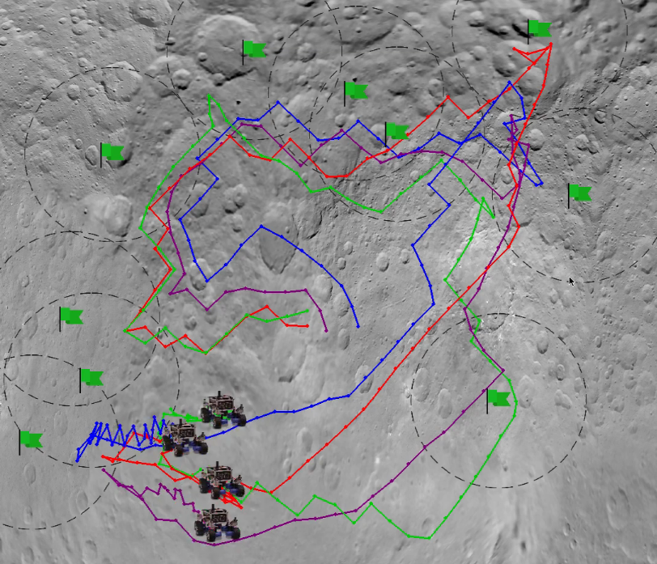

## MADyS: Multiagent Learning via Dynamic Skill Selection

<!-- <iframe width="560" height="315" src="https://www.youtube.com/watch?v=kXY4NN7Q3p0" frameborder="0" allow="accelerometer; autoplay; encrypted-media; gyroscope; picture-in-picture" allowfullscreen></iframe>   -->

<!-- -->

[code](https://github.com/EnnaSachdeva/MADyS) [Master's Thesis](https://ir.library.oregonstate.edu/downloads/gq67jz60h?locale=en) 

<a href="https://www.youtube.com/watch?v=viH08VrIIA8
" target="_blank"> Video </a>

Learning in tightly coupled multiagent settings with sparse rewards
is challenging because multiple agents must reach the goal state
simultaneously for the team to receive a reward. This is even more
challenging under temporal coupling constraints - where agents
need to sequentially complete different components of a task in a
particular order. Here, a single local reward is inadequate for learning an effective policy. We introduce MADyS, Multiagent Learning
via Dynamic Skill Selection, a bi-level optimization framework that
learns to dynamically switch between multiple local skills to optimize sparse team objectives. MADyS adopts fast policy gradients to
learn local skills using local rewards and an evolutionary algorithm
to optimize the sparse team objective by recruiting the most optimal
skill at any given time. This eliminates the need to generate a single
dense reward via reward shaping or other mixing functions. In environments with both spatial and temporal coupling requirements,
we outperform prior methods and provides intuitive visualizations
of its skill switching strategy.

## Resume Classification

<!-- <iframe width="560" height="315" src="https://www.youtube.com/watch?v=kXY4NN7Q3p0" frameborder="0" allow="accelerometer; autoplay; encrypted-media; gyroscope; picture-in-picture" allowfullscreen></iframe>   -->
<!-- -->
[code](https://github.com/EnnaSachdeva/Resume-Screener) 
<a href="https://www.youtube.com/watch?v=kXY4NN7Q3p0
" target="_blank"> Video </a>
In this project, we aim to classify a resume for a specific role. We trained an LSTM model. The data is cleaned and pre-processed using NLTK and Keras, to eliminate stop words, and tokenize the words. We used a resume dataset from Kaggle (https://www.kaggle.com/dhainjeamita/resume-classification), which consists of 1000 resumes with 25 different categories. We achieved a validation accuracy of 99% with our trained model. We further deploy the model on an https server to screen any resume which is input by a user, and shows the top 5 categories, for which that resume seems to fit the best. 

## Visual Navigation based Environment Exploration
<!-- <iframe width="560" height="315" src="https://www.youtube.com/embed/eGDtGmRTzaQ" frameborder="0" allow="accelerometer; autoplay; encrypted-media; gyroscope; picture-in-picture" allowfullscreen></iframe>   -->
<!-- -->
<a href="https://www.youtube.com/embed/eGDtGmRTzaQ
" target="_blank"> Video </a>
In this project, we aim to maximize the exploration coverage of a partially unknown environment. Inspired by the DARPA Sub-T challenge, the task is to learn appropriate structure predictions of an unknown tunnel, so as to maximally explore the environment with a limited fuel in the robot. Given the frontiers along with the information of the history of the previously explored region and occupancy map, the agent aims to learns a policy to visit the unexplored regions so as to maximize the coverage in a given time constraint. Inspired by the structural distribution of coal mines across the world, we generated a "Tunnel Dataset" with Multimodal Gaussian distribution. The dataset consists of Grid world like maps with traversable nodes sampled from multimodal Gaussian Points. The agent learns a policy with a Reinforcement learning algorithm: Proximal Policy Optimization (PPO), to maximize exploration within a specific time limit as the number of traversable nodes. To generate the oracle policy which could give optimal action at every state to maximize the percentage exploration in a limited time budget, we formulated an Optimization problem using Orieteering (an extension of Travelling Salesman Problem with additional constraint of limited time). The PPO trained agent is able to achieve a percentage exploration of 78.38% as compared to 89.21% with Orienteering agent and 59.20% with random agent. 

## Autonomous Building Floor Activity Profiling System
<!-- <iframe width="560" height="315" src="https://youtu.be/KmoZzMOiX5c" frameborder="0" allow="autoplay; encrypted-media" allowfullscreen></iframe> -->
<a href="https://youtu.be/KmoZzMOiX5c
" target="_blank"> Video </a>
Occupancy profiling in large buildings can aid in identifying areas of low space usage throughout the day. In addition to providing insights on how to allocate resources like lighting, cooling, heating and ventilation in a more optimized manner, it can also be used to re-plan the arrangement of office resources dynamically. Today, most of the newly constructed
buildings are integrated with occupancy sensors, such as passive infrared sensors (PIR), to identify the user occupancy levels
and thereby manage resource allocation and optimize energy usage. However, it is not always feasible to retrofit these sensor
control systems in old buildings. To address this issue, we propose an autonomous mobile system to generate occupancy
heat maps of building floors with minimal setup. The robot will autonomously navigate through predetermined waypoints
on the floor and will gather occupancy data on an hourly basis. Initial simulations of the same are performed on RViz and
sim-to-real implementation are done on a Pioneer-P3DX robot retrofitted with a Xbox 360 Kinect sensor and a webcam.

## Autoencoders to enhance Multiagent Coordination in a Tightly-Coupled Domain
[code](https://github.com/EnnaSachdeva/D_VAE)  [Report](https://github.com/EnnaSachdeva/D_VAE/blob/master/Project_report.pdf) 
<!-- <iframe width="560" height="315" src="https://www.youtube.com/watch?v=MmVGEEDoO_A&feature=youtu.be" frameborder="0" allow="autoplay; encrypted-media" allowfullscreen></iframe> -->
<!-- <iframe width="560" height="315" src="https://www.youtube.com/watch?v=Q1Kl0wrkQd0&feature=youtu.be" frameborder="0" allow="autoplay; encrypted-media" allowfullscreen></iframe> -->
<!-- <iframe width="560" height="315" src="https://www.youtube.com/watch?v=5hfmW056Sys&feature=youtu.be" frameborder="0" allow="autoplay; encrypted-media" allowfullscreen></iframe> -->
<a href="https://youtu.be/MmVGEEDoO_A
" target="_blank"> Video-1 (with actual state space) </a>
<a href="https://youtu.be/Q1Kl0wrkQd0
" target="_blank"> Video-2 (with state compression from 40 to 10) </a>
<a href="https://youtu.be/5hfmW056Sys
" target="_blank"> Video-3 (with state compression from 40 to 5) </a>
Deep Reinforcement learning has been shown to address several multi-agent coordination tasks. However, with the increase in the number of agents as well as in tightly-coupled settings, learning optimal joint policies becomes challenging. In this paper, we address these 2 problems in a partially-observable rover domain environment using Deep Deterministic Policy Gradient (DDPG) and autoencoders. We obtain decentralized optimal policies with each agent trained using independent DDPG algorithm. Further, we compress the state space using autoencoders to test the efficacy of the latent representation of the state in finding the optimal policies in a tightly-coupled multiagent environment. We further compare  results with 2 different latent state dimensions of 5 and 10, with that of the complete state representation of dimension of 40, and our results show that latent representation of 10 performs equally well as that with complete state representation.

## Distributed Solutions to Temporally-Coupled Sequential Tasks
Multiagent teams are strong candidates to solve spatially and temporally distributed tasks, as their inherent flexibility and robustness creates a reliable system. In order for a team to solve a real-world task, such as performing remote exploration, individual agents need to be able to reason about the structure of their goal and how to coordinate their actions with the larger team. In this paper, we focus on generating distributed solutions to temporally-coupled sequential tasks, with higher level goal, unknown to the agents. The proposed method uses a hierarchical approach to learn higher level policies by dividing the goal into several reward signals. We demonstrate the effectiveness of this learning paradigm on a partially observable multiagent coordination task where agents need to perform several tasks in an specific, but unknown, series for agents to receive a reward. We further compare the performance of the proposed approach with a Cooperative Coevolutionary algorithms (CCEA) in both sparse and dense reward setting, while performing the sequences of tasks.
    
## Recurrent Multiagent Deep Deterministic Policy Gradient with Difference Rewards
[code](https://github.com/EnnaSachdeva/Recurrent-Multiagent-Deep-Deterministic-Policy-Gradient-with-Difference-Rewards)  [Report](https://github.com/EnnaSachdeva/Recurrent-Multiagent-Deep-Deterministic-Policy-Gradient-with-Difference-Rewards/blob/master/Autonomous_Agents_Project.pdf) 
Deep Reinforcement Learning (DRL) algorithms have been successfully applied to a range of challenging simulated continuous control single agent tasks. These methods have further been extended to multiagent domains in cooperative, competitive or mixed environments. This paper primarily focuses on multiagent cooperative settings which can be modeled for several real world problems such as coordination of autonomous vehicles and warehouse robots. However, these systems suffer from several challenges such as, structural credit assignment and partial observability. In this paper, we propose Recurrent Multiagent Deep Deterministic Policy Gradient (RMADDPG) algorithm which extends Multiagent Deep Determinisitic Policy Gradient algorithm - MADDPG \cite{lowe2017multi} by using a recurrent neural network for the actor policy. This helps to address partial observability by maintaining a sequence of past observations which networks learn to preserve in order to solve the POMDP. In addition, we use reward shaping through difference rewards to address structural credit assignment in a partially observed environment. We evaluate the performance of MADDPG and R-MADDPG with and without reward shaping in a Multiagent Particle Environment. We further show that reward shaped RMADDPG outperforms the baseline algorithm MADDPG in a partially observable environmental setting.

## COCrIP: Compliant OmniCrawler In-Pipe Climbing Robot
[code](https://github.com/EnnaSachdeva/IROS-2017-COCrIP-Optimization)  [Publication](https://ieeexplore.ieee.org/document/8206446) 
<!-- [Video](https://www.youtube.com/watch?v=Esd47RzzpOU)  -->
<a href="https://youtu.be/Esd47RzzpOU
" target="_blank"> Video </a>
This presents a modular in-pipeline climbing robot with a novel compliant foldable OmniCrawler mechanism. The circular cross-section of the OmniCrawler module enables a holonomic motion to facilitate the alignment of the robot in the direction of bends. Additionally, the crawler mechanism provides a fair amount of traction, even on slippery surfaces. These advantages of crawler modules have been further supplemented by incorporating active compliance in the module itself which helps to negotiate sharp bends in small diameter pipes. The robot has a series of 3 such compliant foldable modules interconnected by the links via passive joints. For the desirable pipe diameter and curvature of the bends, the spring stiffness value for each passive joint is determined by formulating a constrained optimization problem using the quasi-static model of the robot.

## CObRaSO: Compliant Omni-Direction Bendable Hybrid Rigid and Soft OmniCrawler Module
[Paper](https://arxiv.org/abs/1709.10452) 
<!--  [Video](https://www.youtube.com/watch?v=XvvHkCk2Ns4)  -->
<a href="https://youtu.be/XvvHkCk2Ns4
" target="_blank"> Video </a>
This paper presents a novel design of an Omnidirectional bendable Omnicrawler module. Compared to conventional crawlers, OmniCrawler module possesses an extra degree of freedom for sideways rolling motion, and the circular crosssection of the module enables holonomic motion of the robot. These advantages are further enhanced by the introduction of Omnidirectional joint with-in the module, which is the key contribution of this paper. This achieves high maneuverability and adaptability of the OmniCrawler module on an uneven surface. The Omni-directional bending is realized by means of two mechanisms: a Telescopic screw drive mechanism, and an arrangement of two independent 1-DOF joints aligned at 90? with respect to each other. The hybrid soft-rigid structure of the module provides compliant pathways for lug-chain assembly which allows crawling motion even in the bent configuration of the module. We show that the unique modular design unveils its versatility in terms of achieving compliance on an uneven surface, demonstrating its applications in different robotic platforms, such as an in-pipeline robot, Quadruped, snake robot, and exhibiting hybrid locomotive traits in various configurations of the robots with the help of simulations and experiments results on real robot prototype.

## Design of low power VLSI-architecture and ASIC implementation of fuzzy logic based automatic car-parking system
[Paper](https://ieeexplore.ieee.org/document/7839149) 
This work includes the overall system design of the automatic car-parking application where its non-linear control estimation is based on the fuzzy logic control (FLC) model. The finite state machine (FSM) based central controller has been used to operate such FLC model. It performs a series of operations required for the real-time car parking process.  Subsequently, the defuzzifier architecture has been further optimized using resource sharing technique which reduces the overall chip area and power consumption of the proposed car parking system. Additionally, the field-programmable-gate-array (FPGA) synthesis and application-specific-integrated-circuit (ASIC) implementations of the suggested architecture was compared with the conventional architecture. Functional verification of the design using simulation tool for a similar set of inputs has been performed in this work. Thus, the suggested architecture occupies an area of 46335 ?￰ﾝﾑﾚ2 and consumes a total power of 0.06254 mW at 60 MHz, when synthesized and post-layout simulated in 180 nm complementary metal-oxide-semiconductor (CMOS) technology node.

## Improving method of correcting AES Keys obtained from cold boot attack
[Paper](https://ieeexplore.ieee.org/document/7226024) 
Extraction of cryptographic keys, passwords and other sensitive information from the memory, has been made possible by the data remanence property of DRAM. According to it, DRAM can retain its data for several seconds to minutes without power. Cold boot attack proposed earlier tries to exploit memory remanence property, for extracting probable cryptographic secrets from DRAM. However, the extracted information is degraded and needs to be corrected before being used for decrypting the encrypted files. Various methods for correcting this distorted data for different cryptosystems have been proposed. However, it has not been reported much in the literature regarding the efficacy of these methods. This paper contains results and observations of extensive experiments carried out for correcting AES keys, by varying timings of cold rebooting the PC that varies the % of distorted data. These observations suggest that the proposed methods are theoretical in nature and not effective practically( for cold boot attack) as they could correct keys corresponding to up to 2% of erroneous round key schedules of AES-128 and AES-256. In this paper, an improved algorithm has been proposed for correcting up to 15% of errors in cold boot attack generated as well as randomly generated distorted round key schedules. The proposed algorithm has been successfully implemented to mount the volumes encrypted by popular disk encryption system 'TrueCrypt.

## Design and Development of a personalized cooling chair to save energy
The chair incorporates several thermoelectric Peltier cooling modules to provide cooling in the sensitive areas of the legs when a person sits on it. This personalized thermoelectric cooling significantly reduces the energy consumption of the centralized air conditioner in the room. 

## Heart Rate Monitoring System using Zigbee
The circuit detects the heart rate of a person through an optical sensor.  When the heart beats, blood pumping  throughout body changes the volume inside the finger artery. This blood fluctuation is detected through an optical sensor placed around the fingertip. The signal needs amplification so that microcontroller(PIC16F628A ) could count the rate of fluctuation, which is the heart rate count. This data is sent to the doctor via a wireless communication protocol, Zigbee.

